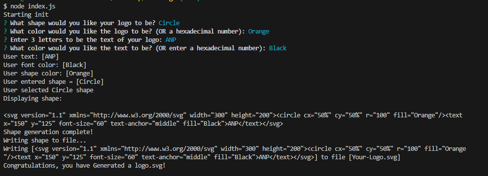
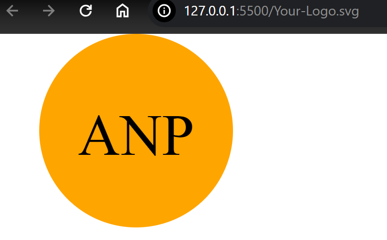

# Auto-Logo
A node.js command line application that prompts a user and then creates a logo based on the answers provided.

## Screenshot of the finished product

## Credit
Thomas Calle - https://github.com/ThomasCalle/Thomas-Object-Oriented-Programming-SVG-Logo-Maker

Copied some of his code, modified it, changed certain perameters, added some of my own ideas, etc.

## Future Modifications

I would like to:
- Go back through the code and comment the code properly.
- Clean the VS code up by adding folders.
- Edit the SVG print out so it is indented onto the webpage better. Just to look more appealing.